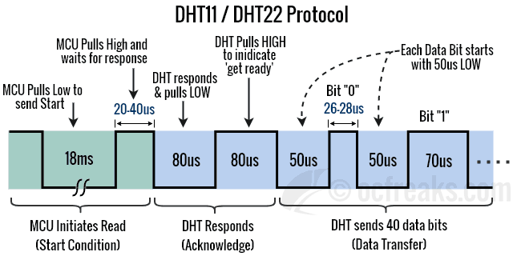

# DHT22

DHT22 is a temperature and humidity sensor. It is a digital sensor that communicates with the microcontroller using a single wire protocol.

I have created this library according to the communication flow below:



## How to Use the Library

- Copy the DHT22 folder to the Drivers folder in your project.

- Add library executable path to CmakeLists.txt:

```cmake
# Add sources to executable
target_sources(${CMAKE_PROJECT_NAME} PRIVATE
    # Add user sources here
    Drivers/dht22/Src/dht22.c
)
```

- Add library include path to CmakeLists.txt:

```cmake
# Add include paths
target_include_directories(${CMAKE_PROJECT_NAME} PRIVATE
    # Add user defined include paths
    Drivers/dht22/Inc
)
```

- Then, you can import it from your source code:

```c
int main(void)
{
  HAL_Init();
  SystemClock_Config();
  MX_GPIO_Init();
  MX_USART2_UART_Init();
  MX_TIM6_Init();

  DHT22 dht = {0};
  DHT22_Init(&dht, DHT22_DWT, DHT22_GPIO_Port, DHT22_Pin);
  
  // If you use timer mode, you should configure the timer with the following function.
  // DHT22_Configure_Timer(&dht, &htim6, HAL_RCC_GetPCLK1Freq());

  // If you want to set the temperature unit to Fahrenheit or Kelvin, you can use the following function.
  // It is set to Celsius by default.
  DHT22_SetTempUnit(&dht, DHT22_TEMP_FAHRENHEIT);
  
  while (1)
  {
    double temperature = 0;
    double humidity = 0;
    char buffer[100];

    if (DHT22_Read(&dht, &temperature, &humidity) == HAL_OK)
    {
      memset(buffer, 0, sizeof(buffer));
      sprintf(buffer, "Humidity: %f\n", humidity);
      HAL_UART_Transmit(&huart2, (uint8_t *)buffer, strlen(buffer), HAL_MAX_DELAY);

      memset(buffer, 0, sizeof(buffer));
      sprintf(buffer, "Temperature: %f\n", temperature);
      HAL_UART_Transmit(&huart2, (uint8_t *)buffer, strlen(buffer), HAL_MAX_DELAY);
    }
    else
    {
      memset(buffer, 0, sizeof(buffer));
      sprintf(buffer, "Error reading DHT22\n");
      HAL_UART_Transmit(&huart2, (uint8_t *)buffer, strlen(buffer), HAL_MAX_DELAY);
    }

    HAL_Delay(2000);
  }
}
```

**Note:** I don't recommend using `DHT22_Systick` mode as delay mode as it is not accurate and stable. You can use `DHT22_Timer` or `DHT22_DWT` mode for accurate timing.

**Note:** You should wait for at least 2 seconds between each read operation to get proper results.

**Note:** DWT feature is not available in Cortex-M0 and Cortex-M0+ processors. You can use `DHT22_Timer` mode for these processors.

**Note:** I have included `#include "stm32l4xx_hal.h"` since i have a STM32L4 series MCU. You need change it according to the MCU series you have.

## Functions

### DHT22_Init

DHT22_Init initializes the DHT22 for communication.
It is recommended to use DWT or timer mode as a delay method.
You need to call DHT22_Configure_Timer after this function if you want to use timer mode.

```c
HAL_StatusTypeDef DHT22_Init(DHT22 *dht22, DHT22_DelayMethod delay_method, GPIO_TypeDef *port, uint32_t pin)
```

### DHT22_Configure_Timer

DHT22_Configure_Timer configures the timer for DHT22 communication.

```c
HAL_StatusTypeDef DHT22_Configure_Timer(DHT22 *dht22, TIM_HandleTypeDef *timer, uint32_t apb_freq)
```

### DHT22_SetTempUnit

DHT22_SetTempUnit sets the temperature unit for the DHT22. Available units are: DHT22_TEMP_CELSIUS, DHT22_TEMP_FAHRENHEIT, DHT22_TEMP_KELVIN

```c
HAL_StatusTypeDef DHT22_SetTempUnit(DHT22 *dht22, DHT22_TEMP_UNIT temp_unit)
```

### DHT22_Read

DHT22 starts DHT22 communication and reads the temperature and humidity.
If temperature or humidity is NULL, the value is not read.

Returns HAL_OK if the communication was successful, HAL_ERROR otherwise.

```c
HAL_StatusTypeDef DHT22_Read(DHT22 *dht22, double *temperature, double *humidity)
```

## To Do List

- [ ] Stabilise DHT22_Systick mode.
- [ ] Add DHT11/DHT21 support.
- [ ] Add timeout feature to DHT22_Read function in order to prevent infinite loop.